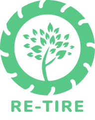
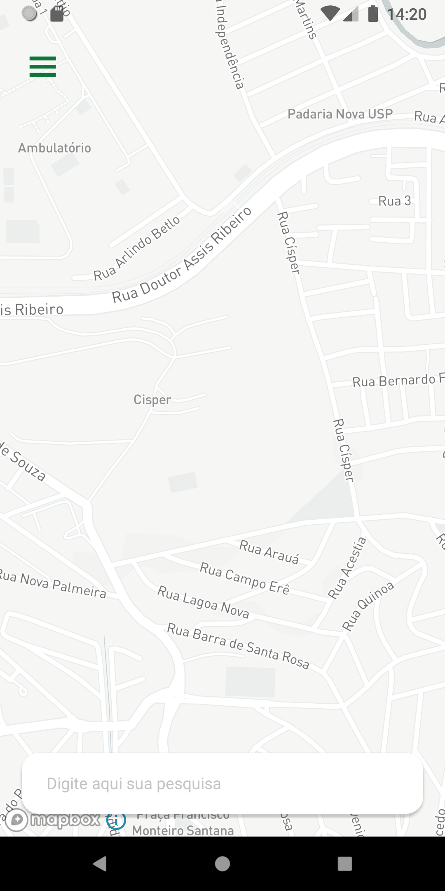
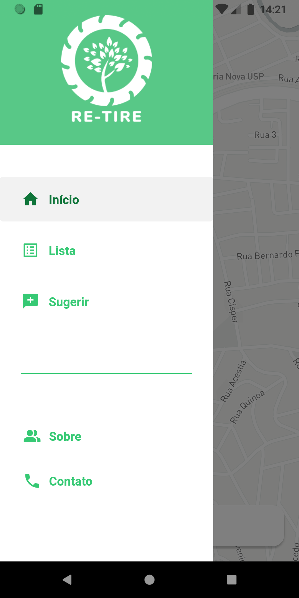
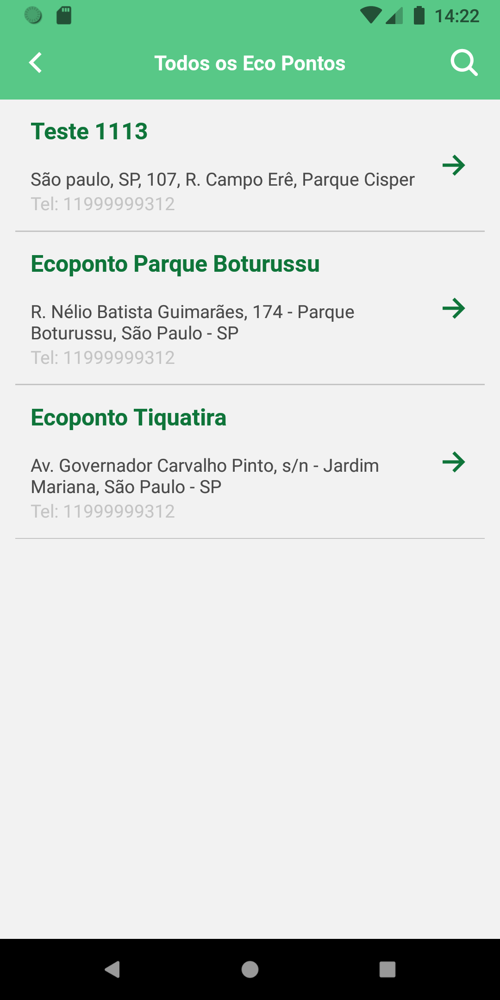
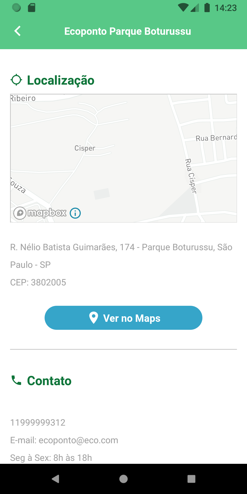

<p align="center">
  
  
  <a href="https://twitter.com/thaian_carvalho">
    
  <a>    
  
  
  
</p>

<p align="center">
  
  <h1 align="center">Re-tire</h1>
  <h3 align="center">Um app feito para auxiliar no descarte correto de pneus</h3>
</p>


---

## Sobre

O Re-tire foi inicialmente feito como um projeto para o meu TCC, e atualmente estou dando continuidade com mais minhas experiências adquiridas desde então e com tecnologias mais atualizadas afim de agregar ao meu portfolio (OBS: projeto ainda em construção).

Seu objetivo inicial é indicar para os usuários onde ficam os eco-pontos mais próximos de seus locais, afim de auxiliar no descarte correto de seus pneus, dessa forma contribuindo com o meio ambiente tendo em vista o atual cenário global onde vemos cada vez mais os prejuizos ao meio ambiente.

## Screenshots
<p align="center">
  
  
  
  
</p>
Acesse o layout completo no [Figma](https://www.figma.com/file/Ki4aM1OaqvQ5oJpsgcDpL5/Re-Tire-Mobile?node-id=0%3A1) (Ainda em construção).

## Features

- [x] Acessar mapa
- [x] Listar eco-pontos
- [x] Visualizar detalhes de cada eco-ponto
- [ ] Pesquisar um eco-ponto específico
- [ ] Sugerir um novo eco-ponto

### Versão Web

Projeto futuro

### API

Acesse a API através deste [link](https://github.com/thcarvalho/api-retire).

---

## Requisitos

Para rodar o app, primeiramente é necessário ter instalado o [Node.js](https://nodejs.org/en/), [Git](https://git-scm.com/), [Android Studio](https://developer.android.com/studio) (Para Android) e opcionalmente um editor de texto, por exemplo [Visual Studio Code](https://code.visualstudio.com/)

Com todas as ferramentas necessárias instaladas, clone e rode a [API](https://github.com/thcarvalho/api-retire) (Instruções dentro do próprio repositório)


## Rodando a aplicação

```
# clone este repósitório
$ git clone https://github.com/thcarvalho/Re-tire
$ cd Re-tire

# instalando as dependências
$ npm install
ou
$ yarn

```

Após isso, crie um arquivo [.env](https://www.npmjs.com/package/dotenv) na raiz do projeto com as seguintes variáveis:

- REACT_APP_API_IP: IP da sua maquina + porta 3333 (ex: http://192.168.0.6:3333)
- REACT_APP_MAPBOX_TOKEN: Token disponibilizado pelo [MapBox](https://www.mapbox.com/) para utilizar o serviço de geolocalização e mapa

```
# rodando no emulador/dispositivo

# ANDROID
$ npm run android 
ou
$ yarn android

# IOS
$ npm run ios 
ou
$ yarn ios

# iniciar a aplicação
$ npm start
ou
$ yarn start
```

---

## Tecnologias utilizadas

- [Typescript](https://www.typescriptlang.org/)
- [React Native](https://reactnative.dev/)
- [React Navigation](https://reactnavigation.org/)
- [React Native Mapbox](https://github.com/react-native-mapbox-gl/maps)
- [React Native Vector Icons](https://github.com/oblador/react-native-vector-icons)
- [Styled Components](https://styled-components.com/)
- [Axios](https://github.com/axios/axios)
- [React Native Dotenv](https://www.npmjs.com/package/react-native-dotenv)

Utilitários

- Layout: [Figma](https://www.figma.com/)
- Maps: [MapBox](https://www.mapbox.com/)
- Editor: [Visual Studio Code](https://code.visualstudio.com/)
- Formatter: [Eslint](https://eslint.org/), [Prettier](https://prettier.io/)
- Commits: [Commitzen](https://github.com/commitizen/cz-cli)

## Autor

Desenvolvido por Thaian Carvalho

Entre em contato!

[](https://twitter.com/thaian_carvalho) 
[](https://www.linkedin.com/in/thaian-carvalho-033753178/) 
[](mailto:th29.br@gmail.com)
